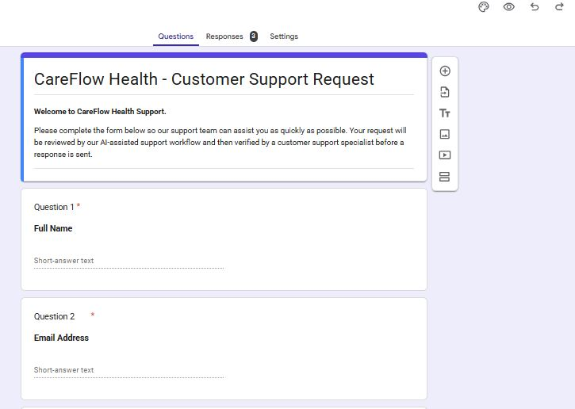
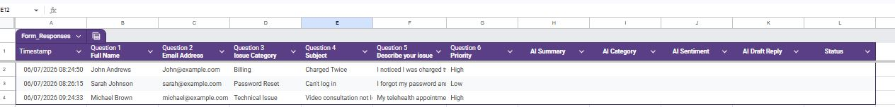

# AI Ticket Triage & Customer Support Automation

An AI-powered customer support ticket triage workflow built with **Google Forms**, **Google Sheets**, **n8n**, **Google Gemini**, and **JavaScript**.

This project demonstrates how AI can streamline customer support operations by automatically analyzing incoming support requests, classifying issues, identifying customer sentiment, and generating professional draft responses while preserving human oversight.

---

# Overview

Customer support teams often spend significant time reviewing repetitive support requests, manually categorizing issues, and drafting responses.

This project demonstrates how workflow automation and generative AI can reduce repetitive work, improve consistency, and create a standardized support process.

The solution was designed as a portfolio case study for a fictional telehealth company, **CareFlow Health**.

---

# Business Problem

Growing customer support teams face several operational challenges:

- Manual ticket review
- Manual issue categorization
- Repetitive response drafting
- Inconsistent customer experience
- Limited operational visibility
- Difficulty scaling support operations

These repetitive activities reduce productivity and delay customer response times.

---

# Solution

This project automates the early stages of customer support using AI.

Workflow:

1. Customer submits a support request through Google Forms.
2. The request is stored automatically in Google Sheets.
3. n8n detects the new support ticket.
4. Google Gemini analyzes the ticket.
5. AI identifies:
   - Issue category
   - Customer sentiment
   - Ticket summary
   - Draft customer response
6. The structured output is prepared for human review before any communication is sent.

---

# Solution Architecture

```
Customer
      │
      ▼
Google Forms
      │
      ▼
Google Sheets
      │
      ▼
Google Sheets Trigger
      │
      ▼
n8n Workflow
      │
      ▼
Google Gemini AI
      │
      ▼
JavaScript Processing
      │
      ▼
Support Queue
      │
      ▼
Human Review
```

---

# Workflow

The workflow consists of four primary stages:

### 1. Ticket Capture

Customer submits a support request using Google Forms.

### 2. Workflow Automation

Google Sheets Trigger initiates the n8n workflow whenever a new support request is received.

### 3. AI Analysis

Google Gemini performs:

- Ticket categorization
- Sentiment analysis
- Issue summarization
- Draft response generation

### 4. Data Processing

A JavaScript Code node converts AI output into structured business data suitable for downstream automation.

---

# Technologies Used

| Technology | Purpose |
|------------|----------|
| Google Forms | Customer support form |
| Google Sheets | Data storage |
| n8n | Workflow automation |
| Google Gemini | AI ticket analysis |
| JavaScript | JSON processing |
| GitHub | Version control & documentation |

---

# Key Features

- AI-powered ticket categorization
- Automatic sentiment analysis
- AI-generated response drafts
- Human-in-the-loop workflow
- No-code/low-code automation
- Structured AI outputs
- Business process automation

---

# Screenshots

## Google Form



## Google Sheets



## n8n Workflow


---

# Business Impact

This project demonstrates how AI can improve operational efficiency by:

- Reducing repetitive manual work
- Standardizing customer support processes
- Improving response consistency
- Accelerating ticket triage
- Supporting human decision-making with AI-generated insights

> **Note:** This is a fictional portfolio project. Any operational improvements described are illustrative estimates based on the simulated workflow.

---

# Future Improvements

Future versions of this solution could include:

- Gmail integration
- Manager approval workflow
- Slack notifications
- CRM integration
- Power BI dashboard
- AI knowledge base (RAG)
- Ticket routing automation
- Analytics dashboard

---

# Lessons Learned

Building this project reinforced several important concepts:

- Effective AI implementation begins with understanding business processes.
- Human oversight remains essential for customer-facing AI workflows.
- Structured AI outputs are easier to integrate into business systems than free-form responses.
- Workflow automation can significantly reduce repetitive operational tasks.

---

# Repository Structure

```
ai-ticket-triage-automation
│
├── README.md
├── workflow/
├── screenshots/
├── presentation/
└── documentation/
```

---

# About the Author

## Oluwaseun Aribisogan

Data Analyst | Business Intelligence | AI Automation

I enjoy designing AI-powered workflows that improve operational efficiency through automation, analytics, and business process optimization.

### Connect with me

- LinkedIn: https://linkedin.com/in/oluwaseun-aribisogan
- GitHub: https://github.com/oluwaseun-tech

---

# Acknowledgements

This project was created as part of my AI Automation portfolio to demonstrate practical implementation of AI-assisted business workflows using modern no-code and low-code technologies.
